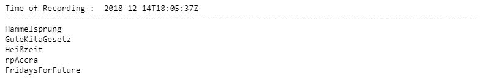
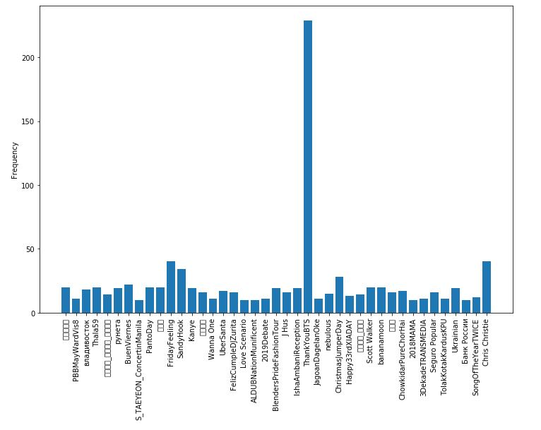

# Analyzing-Top-Trends-on-Twitter-Using-Python

The project is about getting top twitter trends from all around the world through twitter api and analyzing the trends

# Getting data

The python `tweepy` library is used to get the Twitter data for the analysis purpose. The twitter trends are extracted based on
the woeid (where on earth id) vaues. The json file containing woeid values was downloaded from [here](https://codebeautify.org/jsonviewer/f83352).
The file contains a total of 404 different locations of the world. Downloading the top five trends of all the locations took 
some time as the twitter api for trends has a rate of 75 calls per 15 minutes. The twitter trends are parsed and stored in 
dataframes for analysis.

# Getting Top Trends for a City

Since my main task is to analyze the top trends around the world so if any wants to get the current top trends of a particular city 
they cant get the data from the dataframe as getting data for all 404 locations would take time because of call rate limit.
For this purpose I have dedicated a different cell where you just have to change the city name and number of trends you 
want and it will search for the woeid of that city and then call the twitter trend api for that city (if woeid is present) to
return the number of trends specified along with the time of creation.

# Analysing the data

Since, the unique trends in all the locations are to be analyzed so the trends are first converted into `{key:value}` format 
where

    key   = trend name
    value = frequency of the trend
  
The trends with a frequency of less than 10 are removed so that the more used trends could be visualized easily. 
Plotting the frequency against the trends gives the following result.
  

As can be seen in the image, at the time when the code was written the most trending topic on the most locations 
was `#ThankYouBTS`. 

**Note:** Some Korean or Japanese tweets cant be seen in figure as the `matplotlib` is unable to display the text. However 
they can be seen in dataframe. Also I have regenerated the api keys so no use using the ones in the notebook :).
